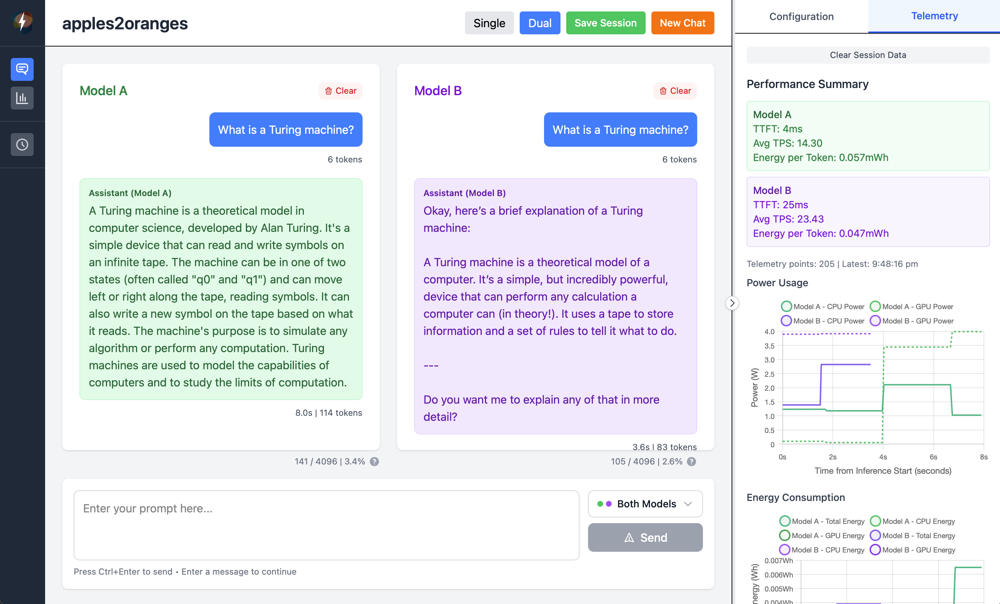

<h1 align="center">
  <br>
  <a></a>
  <br>
  apples2oranges
  <br>
</h1>


# 🍎➡️🍊 apples2oranges

### LLM Comparison Playground for Small Language Models and On-Device AI

*Built by [bitlyte](https://bitlyte.ai) - Building dev tools for small language models and on-device AI*

---

## ✨ Intro

**apples2oranges** is bitlyte's first community contribution to the SLM (Small Language Model) and on-device AI ecosystem! It is a desktop app that allows you to run LLMs through a GUI, get hardware and inference telemetry, and directly compare models side by side. 

We built it with Tauri to keep the telemetry logic as light as we can.

This isn't meant to be a highly serious enterprise-ready tool, but rather a community project to help edge LLM developers profile intelligence<->hardware pairing. It can also be used as an inference client like Ollama for data/telemetry fiends (though we have optimizations to do to make it more usable!)

This is an early release. There will be many bugs and performance issues to solve, as well as many features to come! 

### 🚀 Built for Everyone

- **🧑‍💼 Professionals & Developers**: Get direct model comparisons with quantized variants, clear hardware telemetry, power consumption metrics, inference analytics, multi-session analysis, and comprehensive telemetry data for rigorous model evaluation that matter for production decisions
- **🎯 Hobbyists & Beginners**: Intuitive side-by-side chat interface, easy model loading, and friendly UI to choose what on-device model is your go-to.
- **🎓 Students & Learners**: For understanding how different models behave, learning about quantization trade-offs and hardware utilization.

---

## 🛠️ Tech Stack

**apples2oranges** is built with performance and developer experience in mind:

- **🦀 Rust Backend** 
- **⚡ Tauri Framework** 
- **⚛️ React + TypeScript** 
- **🎨 Tailwind CSS** 
- **📊 Chart.js + Plotly.js** 
- **Macmon, IOHID, sys_info, sysctl** - For comprehensive telemetry
- **🗄️ SQLite** - Session persistence through rusqulite
- **🧠 llama.cpp** - Through the `llama-cpp-2` crate (rust bindings for llama.cpp)

---

## 🌟 Key Features

### 💬 Side-by-Side Model Comparison
- **Dual Chat Interface**: Run two models sequentially and compare responses
- **Smart Memory Management**: Load-run-unload cycle keeps RAM usage minimal
- **Wait for CPU baseline**: Automatically wait for CPU temp to reach baseline before running the second model for reliable comparisons.
- **Directly compare quantized variants**: See quality vs performance trade-offs immediately
- **Hardware Impact Visualization**: How quantization affects power consumption and thermals
- **Token Generation Analysis**: Compare generation speeds across quantization levels
- **Memory Usage Tracking**: Monitor RAM consumption for different model sizes


### 📊 Inference and Hardware Performance Analytics
- **Live Telemetry Dashboard**: Real-time monitoring during inference
- **Hardware Metrics**: CPU/GPU power consumption, temperatures, frequencies
- **LLM Performance**: Time to First Token (TTFT), Tokens Per Second (TPS), generation timing
- **Multi-session Analysis**: Compare up to 7 sessions simultaneously with advanced visualizations. We will be improving these with more useful visualizations.
- **3D Data Exploration**: Scatter plots, radar charts, parallel coordinates, and bubble charts

### Telemetry 
We current expose:
- RAM 
- Per core CPU utilization
- Per sensor CPU temperature
- GPU utilization / temparature
- TPS
- Power and energy usage

and charts that help you visualise relationships over time.


### 🔧 Developer-Friendly Features
- **GGUF Model Support**: Works with any GGUF format model
- **Flexible Configuration**: Save and load model configurations
- **Session Management**: Save complete chat + telemetry sessions to SQLite database

---

## 🚀 Quick Start

### Prerequisites

- **macOS 11+** (Apple Silicon preferred for full feature support, we will be adding Windows support)
- **Node.js** 18+ and npm
- **Rust** 1.77.2+
- **GGUF Models** - Download your favorite models in GGUF format

### Installation & Setup

1. **Clone the Repository**
   ```bash
   git clone https://github.com/bitlyte/apples2oranges.git
   cd apples2oranges
   ```

2. **Install Dependencies**
   ```bash
   npm install
   ```

3. **Install Hardware Monitoring (Recommended)**
   ```bash
   brew install macmon
   ```
   *Note: This enables detailed hardware telemetry without sudo requirements*

4. **Download Your Models**
   
   Download models in GGUF to a folder of your choice.
   - [Hugging Face Hub](https://huggingface.co/models)

5. **Build and Run**
   ```bash
   npm run tauri build
   ```
   Please note we currently recommend running the developer version instead.

   The built app will be in `src-tauri/target/release/bundle/macos/apples2oranges.app`

6. **First Launch (macOS Gatekeeper)**
   
   Since the app isn't signed by Apple (yet!), you might need to:
   - Right-click the `apples2oranges.app` file
   - Select "Open" from the context menu
   - Click "Open" in the security dialog
   - This only needs to be done once!

### Development Mode

For development and testing:
```bash
npm run tauri dev
```

---

## 🎮 How to Use

### Basic Model Comparison
1. **Load Models**: Simply place your model paths into the model config for both model A or B (note can be used with only one model as well)
2. **Set Context**: Configure context window sizes (important for proper memory allocation)
3. **Choose Target**: Select "Both" to compare models side-by-side
4. **Start Chatting**: Type your prompt and watch both models respond simultaneously

### Advanced Analytics
1. **Switch to Analysis Mode**: Click the chart icon in the left sidebar
2. **Select Sessions**: Choose from your saved conversation sessions
3. **Explore Visualizations**: Use 3D plots, radar charts, and parallel coordinates to analyze performance
4. **Compare Multiple Sessions**: Select up to 7 sessions for comprehensive analysis

### Tips
- **CPU Cooldown**: Enable thermal baseline waiting for consistent benchmarking
- **Session Saving**: Save interesting conversations with full telemetry data
- **Configuration Presets**: Save model configurations for quick switching
- **Message Re-running**: Click any user message to re-generate responses from that point

---

## 🚧 Current Limitations

- **macOS Only**: Currently optimized for Apple Silicon, cross-platform support planned
- **Model and Context loading not optimized**: No long conversation memory optimization yet and model load time not optimized.
- **GGUF Only**: Text generation models only (no multimodal support yet)
- **Local Models Only**: No API-based model support (OpenAI, Anthropic, etc.)
- **Memory Requirements**: Large models still need substantial RAM

---

## 🗺️ Feature Roadmap

### Phase 1: Cross-Platform Expansion 🌐
- **Linux Support**
- **Windows Support**
  (star to follow!)

### Phase 2: Model Support Enhancement 🧠
- **Multimodal Models**: Vision and audio model support
- **API Integration**: OpenAI, Anthropic, and other API providers so you can compare with cloud hosted models too.
- **Context Optimization**: Persistent model loading for extended conversation

Let us know what else you'd like!
---

## 🤝 Contributing

We're excited to build this together with the community! **apples2oranges** thrives on diverse perspectives from professionals to hobbyists. Please read the contribution guidelines as well!

### Ways to Contribute

We welcome all forms of contribution from small to big.
- **🐛 Bug Reports**: Found something broken? Open an issue with details!
- **💡 Feature Requests**: Have ideas for making model comparison better? We want to hear them!
- **📝 Documentation**: Help us make the docs clearer for newcomers
- **🔧 Code Contributions**: Submit PRs for bug fixes, features, or optimizations
- **🎨 Design**: UI/UX improvements and accessibility enhancements
- **📊 Testing**: Help test on different hardware configurations and models
- **⬆️ Sharing**: Share the project around. More interest means more contributors and more features!

### Getting Started with Development

1. **Fork the Repository**: Create your own copy on GitHub
2. **Set up Development Environment**: Follow the installation steps above
3. **Pick an Issue**: Look for "good first issue" or "help wanted" labels
4. **Create a Branch**: `git checkout -b feature/your-amazing-feature`
5. **Make Changes**: Write code, tests, and documentation
6. **Submit a PR**: We'll review and provide feedback!

### Contribution Guidelines

- **Code Style**: We use Rust standard formatting and ESLint for TypeScript
- **Testing**: Add tests for new features (we're working on improving coverage!)
- **Documentation**: Update docs for user-facing changes
- **Performance**: Keep the focus on speed and efficiency for local AI
- **Accessibility**: Ensure features work for users with different needs

### Becoming a Maintainer

Regular contributors who demonstrate good judgment, technical skills, and alignment with project goals are invited to join the maintainer team. Reach out if you're interested in taking on more responsibility!

---

## 🙏 Credits & Acknowledgments

**apples2oranges** is built on the shoulders of these open-source projects:

- **[llama.cpp](https://github.com/ggerganov/llama.cpp)** - The incredible inference engine that makes local AI possible
- **[llama-cpp-rs](https://github.com/utilityai/llama-cpp-rs)** (`llama-cpp-2`) - Rust bindings for llama.cpp
- **[Tauri](https://github.com/tauri-apps/tauri)** - Secure, fast, cross-platform desktop apps
- **[macmon](https://github.com/vladkens/macmon)** - Sudoless Apple Silicon monitoring
- **[Rusqlite](https://github.com/rusqlite/rusqlite)** - SQLite bindings for Rust


---

## 💌 Contact & Support

### Get in Touch
- **Email**: [hello@bitlyte.ai](mailto:hello@bitlyte.ai)
- **X**: [@bitlyte](https://x.com/AntoineN76659)
- **Company**: [bitlyte.ai](https://bitlyte.ai) - *Tools for small language models and on-device AI*
- **Issues**: [GitHub Issues](https://github.com/bitlyte/apples2oranges/issues)
- **Discussions**: [GitHub Discussions](https://github.com/bitlyte/apples2oranges/discussions)

### Support the Project
- **⭐ Star the Repository**: Show your support and help others discover the project
- **🐦 Share on Social**: Help spread the word about local AI development
- **📝 Write About It**: Blog posts, tutorials, and reviews help the community grow
- **🤝 Contribute**: Code, documentation, and feedback make the project better

---

## 📄 License

This project is open source and available under the Apache 2.0 License.

---
